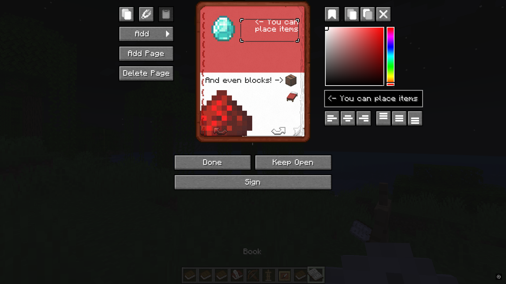
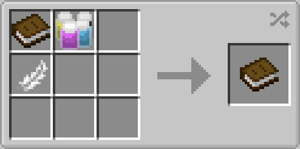
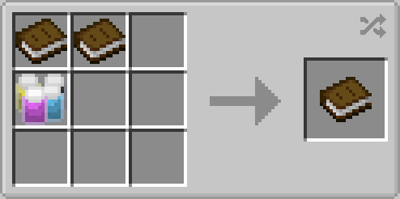
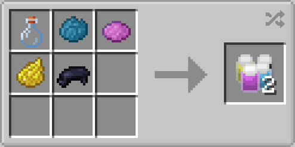

# Advanced Book

Advanced book is a mod that adds graphics to books! You can create books with picture of items, text and other graphic elements.
## Overview

## Recipes

Book

Book Cloning

Paint

## Localizations:
- English (en_us)
- Russian (ru_ru)
- LOLCAT (lol_us)

